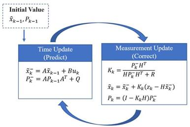

============================================================================
2B SABİT HIZ (Constant Velocity) KALMAN FİLTRESİ

Durum vektörü:  x = [px, py, vx, vy]^T   (konum + hız, dünya/odom çerçevesi)
Ölçüm vektörü:  z = [px, py]^T           (yalnızca konum gözlenir)

Amaç: Tank hareket ederken lidardan gelen gürültülü engel konumlarını
zamanla düzgünleştirmek. Ham lidar ölçümü tur-be-tur birkaç cm sıçrar;
filtresiz bakınca sabit bir koni "sapıyormuş" gibi görünür. Sabit hız
modeli bu gürültüyü bastırır ve engelin gerçek konumunu/hızını kestirir.

Denklemler (standart lineer Kalman):
  Tahmin:   x' = F x            P' = F P F^T + Q
  Güncelle: y  = z - H x'       S = H P' H^T + R
            K  = P' H^T S^-1     x = x' + K y     P = (I - K H) P'
============================================================================

Değişken,Adı,Görevi
-Xk​,Durum Vektörü,  "Sistemin takip edilen fiziksel durumlarını (konum, hız vb.) tutar."
-Pk​,Durum Kovaryans Matrisi,"Tahminimizin ne kadar belirsiz olduğunu tutar. Küçük değer, yüksek güven demektir."
-F,Durum Geçiş Matrisi,"Sistemin bir önceki andan şu anki ana, fiziğe göre nasıl değiştiğini modeller."
-B,Kontrol Giriş Matrisi,Sisteme verilen dış komutların durumu nasıl etkilediğini tanımlar.
-Uk​,Kontrol Vektörü,"Verilen komutların şiddetidir (motor torku, gaz pedalı vb.)."
-Zk​,Ölçüm Vektörü,Sensörden o an okunan ham değerdir.
-H,Gözlem (Ölçüm) Matrisi,"Durum vektöründeki (konum/hız) formatı, sensörün ölçtüğü formata çevirir."
-Q,Süreç Gürültüsü Kovaryansı,Matematiksel modelimizin veya fiziğin ne kadar kusurlu/eksik olduğunu temsil eder.
-R,Ölçüm Gürültüsü Kovaryansı,Sensörümüzün (örn: enkoder veya LiDAR) ne kadar gürültülü olduğunu temsil eder.
-Kk​,Kalman Kazancı (Gain),Tahminimize mi yoksa sensör ölçümüne mi daha çok güveneceğimize karar veren orandır.

Eklenen dosyalar

src/ika_navigation/ altında:

Dosya: src/vfh_plus.cpp + include/.../vfh_plus.hpp
Algoritma / Rol: VFH+ — /scan'den polar histogram, engel şişirme,
histerezisli ikili histogram, maliyet fonksiyonuyla güvenli yön seçimi
────────────────────────────────────────
Dosya: src/kalman_filter.cpp + include/.../kalman_filter.hpp
Algoritma / Rol: Kalman Filter — sabit-hız 2B KF + ObstacleTracker
(nearest-neighbor ile çoklu engel takibi)
────────────────────────────────────────
Dosya: src/stanley_controller.cpp + include/.../stanley_controller.hpp
Algoritma / Rol: Stanley Controller — waypoint yol takibi, çapraz + yönelim
 hatası düzeltme
────────────────────────────────────────
Dosya: src/ika_navigation_node.cpp + .hpp
Algoritma / Rol: Üçünü birleştiren ROS 2 düğümü
────────────────────────────────────────
Dosya: CMakeLists.txt, package.xml, launch/, test/
Algoritma / Rol: Build + launch + gtest birim testleri

Boru hattı (nasıl çalışıyor)

/odom ──► STANLEY ──► istenen yön ──┐
                                     ├─► VFH+ ──► güvenli yön ──► /cmd_vel (Twist)
/scan ──► engel kümeleri ──► KALMAN ─┘        (engelleri odom'da stabil tutar)

- Stanley "nereye gitmek istediğini", VFH+ "koni/bariyere çarpmadan nasıl gidileceğini", Kalman ise "tank hareket ederken engellerin gerçek/sapmasız konumunu" veriyor — tam senin istediğin gibi.
- Kalman izleri hıza göre renklenip tracked_obstacles MarkerArray'iyle RViz'e basılıyor (kayar bariyer kırmızı, sabit koni yeşil).

Jetson'da derleme/çalıştırma

cd ~/KARAN_IKA_Lidar
colcon build --packages-select ika_navigation
source install/setup.bash

# 1. terminal: lidar
ros2 launch rplidar_a2m12_driver rplidar.launch.py
# 2. terminal: navigasyon
ros2 launch ika_navigation ika_navigation.launch.py
Birim testleri: colcon test --packages-select ika_navigation

Devreye alırken dikkat etmen gereken 2 nokta

1. odom kaynağı gerekli — Stanley yol takibi ve Kalman'ın engelleri sabit çerçevede tutması için aracın /odom yayını şart. Odom yoksa düğüm otomatik olarak sadece VFH+ engelden kaçınmaya düşer (yol takibi devre dışı).
2. scan_angle_offset — lidarın montaj açısına göre "ileri" yönü ayarlamak için launch'ta bu parametreyi kalibre et (ışın 0'ı fiziksel ön ile hizala). Hız/dönüş limitleri de (max_linear_speed, angular_gain, vfh.robot_radius) tankının gerçek boyutuna göre launch dosyasından ayarlanabilir.

Waypoint'leri launch/ika_navigation.launch.py içindeki waypoints: [x0,y0, x1,y1, ...] listesinden veriyorsun (şu an örnek bir kare rota var).